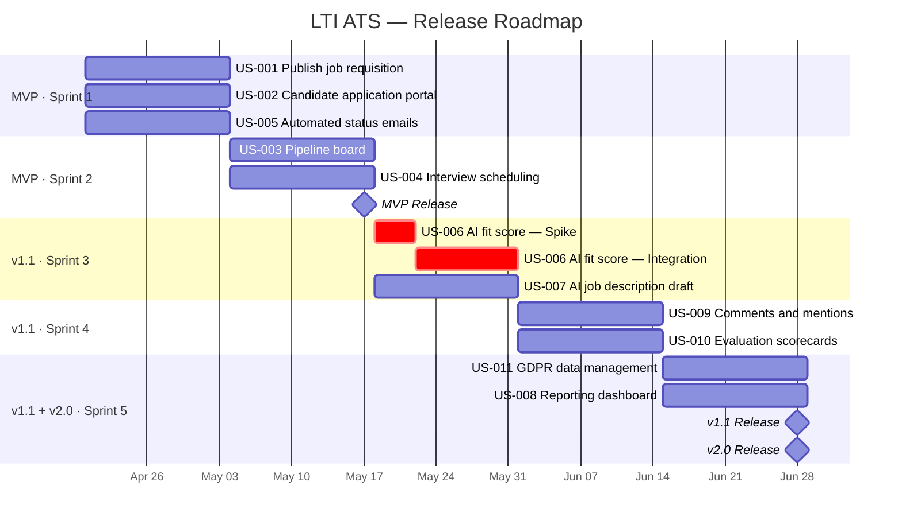

# LTI ATS — User Stories

_Generated from: LTI-JCT/PRD-JCT.md_
_Date: 2026-04-05_

---

## Epic Index

| ID    | Epic Name                          | Business Objective                                              | Linked KPI                              | FR Coverage                     |
|-------|------------------------------------|-----------------------------------------------------------------|-----------------------------------------|---------------------------------|
| EP-01 | Core Recruitment Pipeline          | Centralise job posting, applications, and candidate management  | Reduce time-to-hire to ≤ 28 days        | FR-001, FR-002, FR-003, FR-006, FR-009 |
| EP-02 | AI-Assisted Hiring                 | Accelerate decisions with AI scoring, drafting, and reporting   | AI adoption ≥ 70%; ≥ 25 candidates/week | FR-004, FR-005, FR-011          |
| EP-03 | Collaboration, Compliance & Admin  | Enable team feedback and satisfy GDPR obligations               | Feedback response ≤ 24 h; GDPR-ready   | FR-007, FR-008, FR-010          |

---

## EP-01: Core Recruitment Pipeline

**Business objective**: Give recruiters a single place to post jobs, receive applications, and manage candidates through a configurable pipeline — eliminating spreadsheets and email threads.
**Linked KPI**: Reduce time-to-hire from 40 days to ≤ 28 days; application-to-response time ≤ 48 hours.

---

### US-001: Publish a job requisition

**Story**: As an **HR Recruiter**, I want to create and publish a job requisition with title, department, and pipeline stages, so that the role is visible to candidates and the hiring workflow is ready to use.

**Priority**: Must have
**Linked FR**: FR-001
**Epic**: EP-01

**Acceptance Criteria**:

**Scenario 1:** Successful job publication
- **Given** a recruiter is logged in and fills in title, department, and at least one pipeline stage
- **When** they click "Publish"
- **Then** the job appears in the active jobs list, a unique application URL is generated, and the configured pipeline stages are attached

**Scenario 2:** Incomplete form blocked
- **Given** a recruiter attempts to publish without a department
- **When** they click "Publish"
- **Then** the form shows a validation error and the job is not created

**Scenario 3:** Close a filled position
- **Given** an active job requisition exists
- **When** the recruiter marks it as "Filled"
- **Then** the application URL becomes inactive and the requisition moves to the closed jobs archive

**INVEST Evaluation**

| Criterion | Rating | Notes |
|-----------|--------|-------|
| Independent | ✅ | No runtime dependency on other stories; form and API can be built as a standalone module |
| Negotiable | ✅ | Field set, validation rules, and "Filled" flow are open to refinement before sprint start |
| Valuable | ✅ | Enables the entire hiring workflow — zero hiring without a posted job requisition |
| Estimable | ✅ | Well-understood CRUD form pattern; 2 tickets sized at 6 pts |
| Small | ✅ | 6 pts fits comfortably within a 20-pt sprint |
| Testable | ✅ | 3 BDD scenarios with binary, observable outcomes (list visible, URL inactive, archive entry) |

---

### US-002: Apply for a job as a candidate

**Story**: As a **Candidate**, I want to submit an application and upload my resume via a public web form, so that I can apply without creating an account on a third-party site.

**Priority**: Must have
**Linked FR**: FR-002
**Epic**: EP-01

**Acceptance Criteria**:

**Scenario 1:** Successful application submission
- **Given** a candidate accesses a published job URL
- **When** they complete the form and upload a valid resume (PDF or DOCX, ≤ 5 MB)
- **Then** a confirmation email is sent within 2 minutes, a candidate profile is created, and they appear in the first pipeline stage

**Scenario 2:** Duplicate application rejected
- **Given** a candidate has already applied to a role with the same email
- **When** they attempt to submit again
- **Then** the system shows an informative message and the original application is preserved unchanged

**Scenario 3:** GDPR consent captured
- **Given** a candidate submits the form
- **When** the submission is processed
- **Then** explicit consent to process personal data is recorded with a timestamp and stored as an auditable record

**INVEST Evaluation**

| Criterion | Rating | Notes |
|-----------|--------|-------|
| Independent | ⚠️ | Logically requires an active job (US-001) at runtime, but the form can be developed and tested with a stub URL |
| Negotiable | ✅ | Question fields, file-size limits, and duplicate-rejection policy are open to refinement |
| Valuable | ✅ | Without this story no candidate can enter the pipeline; blocks the entire hiring loop |
| Estimable | ✅ | Standard form + file upload + consent capture; 3 tickets at 8 pts |
| Small | ✅ | 8 pts fits within a 20-pt sprint |
| Testable | ✅ | 3 BDD scenarios covering confirmation email, duplicate guard, and GDPR consent record |

---

### US-003: Manage candidates on the pipeline board

**Story**: As an **HR Recruiter**, I want to view all candidates for a job in a visual pipeline board and move them between stages, so that I can manage the hiring workflow at a glance without navigating multiple screens.

**Priority**: Must have
**Linked FR**: FR-003
**Epic**: EP-01

**Acceptance Criteria**:

**Scenario 1:** Move a candidate to a new stage
- **Given** a recruiter views a candidate card on the pipeline board
- **When** they drag the card to a new stage column
- **Then** the candidate's stage updates immediately, any configured automations for that stage trigger, and an audit log entry is created with actor and timestamp

**Scenario 2:** Bulk stage move
- **Given** a recruiter selects multiple candidates
- **When** they choose "Move to stage" from the bulk actions menu
- **Then** all selected candidates move to the specified stage and automations fire for each individually

**INVEST Evaluation**

| Criterion | Rating | Notes |
|-----------|--------|-------|
| Independent | ⚠️ | Needs candidate data (US-002) at runtime, but the Kanban UI can be built and tested against mock data |
| Negotiable | ✅ | Card fields, column layout, and automation trigger scope are open to refinement |
| Valuable | ✅ | Core recruiter workflow; without pipeline visibility hiring management remains in spreadsheets |
| Estimable | ✅ | Kanban drag-and-drop pattern is well-understood; 2 tickets at 8 pts |
| Small | ✅ | 8 pts fits within a 20-pt sprint |
| Testable | ✅ | 2 BDD scenarios with audit log assertions (actor + timestamp) and automation fire confirmation |

---

### US-004: Schedule an interview with automatic invites

**Story**: As an **HR Recruiter**, I want to schedule interviews from the candidate profile and have calendar invites sent automatically to all participants, so that I eliminate back-and-forth coordination emails.

**Priority**: Must have
**Linked FR**: FR-006
**Epic**: EP-01

**Acceptance Criteria**:

**Scenario 1:** Interview scheduled successfully
- **Given** a candidate is in an interview-eligible stage
- **When** the recruiter creates an interview slot and selects participants
- **Then** all participants receive a calendar invite via email, the interview appears on the candidate's timeline, and a reminder is sent 24 hours before

**Scenario 2:** Interview rescheduled
- **Given** a scheduled interview exists
- **When** the recruiter changes the time
- **Then** updated invites are sent to all participants, the original invite is cancelled, and the candidate's timeline reflects the new time

**INVEST Evaluation**

| Criterion | Rating | Notes |
|-----------|--------|-------|
| Independent | ⚠️ | Logically requires pipeline stages (US-003) to trigger scheduling, but the scheduling panel and iCal service can be built in isolation |
| Negotiable | ✅ | Calendar provider, reminder window (currently 24h), and participant selection rules are negotiable |
| Valuable | ✅ | Eliminates coordination emails; directly supports the time-to-hire ≤ 28-day KPI |
| Estimable | ✅ | iCal generation + email dispatch is a well-known pattern; 3 tickets at 8 pts |
| Small | ✅ | 8 pts fits within a 20-pt sprint |
| Testable | ✅ | 2 BDD scenarios with measurable outcomes (invite received, cancel-and-reissue on reschedule) |

---

### US-005: Receive automated status emails as a candidate

**Story**: As a **Candidate**, I want to receive automated email updates when my application status changes, so that I am not left wondering where I stand in the process.

**Priority**: Must have
**Linked FR**: FR-009
**Epic**: EP-01

**Acceptance Criteria**:

**Scenario 1:** Acknowledgment on application
- **Given** a candidate submits an application
- **When** the submission is processed
- **Then** an acknowledgment email is sent within 2 minutes

**Scenario 2:** Stage-change notification
- **Given** a recruiter moves a candidate to a stage that has an email template configured
- **When** the stage transition occurs
- **Then** the email is sent to the candidate within 5 minutes using the configured template with the candidate's name merged

**Scenario 3:** Rejection notification
- **Given** a recruiter moves a candidate to the "Rejected" stage
- **When** the transition occurs
- **Then** a rejection email is sent automatically and the candidate can no longer access the application portal for that role

**INVEST Evaluation**

| Criterion | Rating | Notes |
|-----------|--------|-------|
| Independent | ⚠️ | Stage transitions (US-003) must exist at runtime to trigger emails, but the template engine and dispatch service can be built and tested independently |
| Negotiable | ✅ | Template design, merge tags, trigger conditions, and delivery SLA (currently 5 min) are negotiable |
| Valuable | ✅ | Reduces candidate anxiety and recruiter support burden; directly supports the ≤ 48h response-time KPI |
| Estimable | ✅ | Template + trigger dispatch pattern; 2 tickets at 6 pts |
| Small | ✅ | 6 pts fits comfortably within a 20-pt sprint |
| Testable | ✅ | 3 BDD scenarios covering acknowledgment, stage-change notification, and rejection with access revocation |

---

## EP-02: AI-Assisted Hiring

**Business objective**: Reduce manual effort in job creation and candidate review by embedding AI scoring, drafting, and insight tools into the core recruiter workflow.
**Linked KPI**: AI adoption ≥ 70% of job postings; recruiter processes ≥ 25 candidates per week.

---

### US-006: Get an AI fit score for every applicant

**Story**: As an **HR Recruiter**, I want to receive an AI-generated fit score with a brief rationale for each applicant, so that I can prioritise my review queue without reading every resume from scratch.

**Priority**: Must have
**Linked FR**: FR-004
**Epic**: EP-02

**Acceptance Criteria**:

**Scenario 1:** Score generated on application
- **Given** a candidate submits an application with a resume
- **When** the system processes the submission
- **Then** a fit score between 0 and 100 is displayed on the candidate card within 60 seconds, accompanied by a rationale of ≤ 3 bullet points, clearly labelled as AI-generated

**Scenario 2:** Recruiter overrides the score
- **Given** a recruiter disagrees with an AI score
- **When** they mark it as "Overridden" and proceed with the candidate
- **Then** the override is recorded in the audit log and the candidate's manual status takes precedence in sorted views

**INVEST Evaluation**

| Criterion | Rating | Notes |
|-----------|--------|-------|
| Independent | ⚠️ | Needs application data (US-002) at runtime; the scoring service can be developed independently with fixture resumes |
| Negotiable | ✅ | LLM provider, scoring scale, rationale format, and override flow are negotiable |
| Valuable | ✅ | Directly enables the ≥ 25 candidates/week KPI by reducing per-resume review time |
| Estimable | ⚠️ | Spike (TK-013) required to confirm model latency and GDPR fit before committing to full estimate; provisional 10 pts |
| Small | ⚠️ | 10 pts consumes half of a 20-pt sprint; TK-013 spike must finish before TK-014 can start |
| Testable | ✅ | 2 BDD scenarios with measurable targets (score displayed within 60s, override recorded in audit log) |

---

### US-007: Draft a job description with AI assistance

**Story**: As an **HR Recruiter**, I want to generate a draft job description using AI when creating a requisition, so that I can post openings faster without starting from a blank page.

**Priority**: Must have
**Linked FR**: FR-005
**Epic**: EP-02

**Acceptance Criteria**:

**Scenario 1:** Draft generated successfully
- **Given** a recruiter has entered a role title and department
- **When** they click "Generate with AI"
- **Then** a structured draft (summary, responsibilities, requirements, nice-to-haves) appears in the editor within 10 seconds and every section is editable before publishing

**Scenario 2:** Draft regenerated after editing
- **Given** a recruiter modifies the key responsibilities in a generated draft
- **When** they click "Regenerate"
- **Then** a new draft incorporating the updated responsibilities is produced and the previous version is accessible via "Undo"

**INVEST Evaluation**

| Criterion | Rating | Notes |
|-----------|--------|-------|
| Independent | ✅ | An optional AI enhancement to the requisition form; US-001 is not a blocker at build time |
| Negotiable | ✅ | LLM provider, draft structure (sections), response time target, and Regenerate/Undo behaviour are negotiable |
| Valuable | ✅ | Reduces time-to-post; directly supports the AI adoption ≥ 70% of job postings KPI |
| Estimable | ✅ | LLM API integration + rich-text editor; 2 tickets at 6 pts |
| Small | ✅ | 6 pts fits comfortably within a 20-pt sprint |
| Testable | ✅ | 2 BDD scenarios with measurable latency target (< 10s) and Undo state verification |

---

### US-008: View pipeline health and time-to-hire metrics

**Story**: As an **HR Recruiter**, I want to view a dashboard showing active pipeline metrics and time-to-hire trends, so that I can identify bottlenecks and report progress to leadership.

**Priority**: Should have
**Linked FR**: FR-011
**Epic**: EP-02

**Acceptance Criteria**:

**Scenario 1:** Dashboard loads with live data
- **Given** a recruiter opens the dashboard
- **When** the page loads
- **Then** they see the number of open roles, total active candidates, and candidates per stage — data no more than 60 seconds stale

**Scenario 2:** Time-to-hire report by date range
- **Given** a recruiter selects a date range
- **When** the report is generated
- **Then** average time-to-hire is shown per job and in aggregate, and stage conversion rates are displayed as a funnel

**INVEST Evaluation**

| Criterion | Rating | Notes |
|-----------|--------|-------|
| Independent | ✅ | Read-only queries against existing data models; no other story blocks development |
| Negotiable | ✅ | Chart types, KPIs surfaced, date-range granularity, and staleness threshold (currently 60s) are negotiable |
| Valuable | ✅ | Enables leadership reporting and bottleneck identification; tagged Should have (v2.0) |
| Estimable | ✅ | Standard BI dashboard pattern; 2 tickets at 8 pts |
| Small | ✅ | 8 pts fits within a 20-pt sprint |
| Testable | ✅ | 2 BDD scenarios with measurable data-staleness constraint (≤ 60s) and funnel display verification |

---

## EP-03: Collaboration, Compliance & Administration

**Business objective**: Enable structured team feedback on candidates and ensure the platform meets GDPR obligations from day one.
**Linked KPI**: Hiring manager feedback response ≤ 24 hours; full GDPR compliance at launch.

---

### US-009: Collaborate on candidates via comments and mentions

**Story**: As a **Hiring Manager**, I want to leave comments on a candidate profile and @mention a colleague, so that collaboration happens in context and not scattered across email threads.

**Priority**: Must have
**Linked FR**: FR-007
**Epic**: EP-03

**Acceptance Criteria**:

**Scenario 1:** Comment with mention submitted
- **Given** a hiring manager is viewing a candidate profile
- **When** they submit a comment containing @username
- **Then** the comment appears immediately on the profile, the mentioned user receives an in-app notification and an email, and all team members with job access can see the comment

**Scenario 2:** Comments inaccessible to candidates
- **Given** internal users have added comments on a candidate profile
- **When** a candidate accesses their application
- **Then** internal comments are not visible to the candidate

**INVEST Evaluation**

| Criterion | Rating | Notes |
|-----------|--------|-------|
| Independent | ✅ | Comment thread only needs candidate profiles to exist; no other story blocks it |
| Negotiable | ✅ | Notification channels (in-app vs email), @mention scope, and visibility rules are negotiable |
| Valuable | ✅ | Replaces scattered email threads with in-context collaboration; supports feedback response ≤ 24h KPI |
| Estimable | ✅ | Comment + notification dispatch pattern; 2 tickets at 6 pts |
| Small | ✅ | 6 pts fits comfortably within a 20-pt sprint |
| Testable | ✅ | 2 BDD scenarios — notification delivery verifiable, candidate visibility enforced at API level |

---

### US-010: Submit and view structured evaluation scorecards

**Story**: As a **Hiring Manager**, I want to complete a structured scorecard after interviewing a candidate, so that my feedback is captured consistently and visible to the full hiring team.

**Priority**: Must have
**Linked FR**: FR-008
**Epic**: EP-03

**Acceptance Criteria**:

**Scenario 1:** Scorecard submitted successfully
- **Given** an interviewer has completed an interview
- **When** they fill in the scorecard and submit
- **Then** the scorecard is saved and linked to the candidate profile, and the recruiter receives a notification that feedback is available

**Scenario 2:** Aggregated results visible to the team
- **Given** multiple interviewers have submitted scorecards for the same candidate
- **When** a recruiter or hiring manager views the candidate profile
- **Then** individual scores with interviewer attribution are visible alongside an average score across all submitted scorecards

**INVEST Evaluation**

| Criterion | Rating | Notes |
|-----------|--------|-------|
| Independent | ⚠️ | Logically follows interviews (US-004), but the form, data model, and aggregated view can be built without it |
| Negotiable | ✅ | Criteria count, scoring scale, locking policy, and HR Admin override capability are negotiable |
| Valuable | ✅ | Replaces ad-hoc notes with structured feedback; supports the feedback response ≤ 24h KPI |
| Estimable | ⚠️ | 11 pts is the largest story in the backlog; roadmap flags it as a split risk (TK-022 vs TK-023) |
| Small | ⚠️ | 11 pts consumes 55% of Sprint 4 capacity; consider splitting TK-022 (template configurator) into a separate story before sprint commit |
| Testable | ✅ | 2 BDD scenarios covering submission persistence and aggregated score display with attribution |

---

### US-011: Manage candidate data to comply with GDPR

**Story**: As an **HR Admin**, I want to export, anonymise, or delete candidate personal data on request, so that the platform honours GDPR rights to portability and erasure.

**Priority**: Must have
**Linked FR**: FR-010
**Epic**: EP-03

**Acceptance Criteria**:

**Scenario 1:** Data export triggered
- **Given** an HR Admin receives a GDPR data access request
- **When** they trigger a data export for the candidate's email
- **Then** a file containing all stored personal data is generated within 72 hours, delivered securely, and the action is logged

**Scenario 2:** Erasure request executed
- **Given** a candidate submits a deletion request
- **When** an HR Admin executes the erasure
- **Then** all personally identifiable information is deleted or anonymised, aggregate metrics derived from that data are preserved in anonymised form, and the deletion event is logged with timestamp and actor

**Scenario 3:** Retention policy alert
- **Given** a candidate's application has exceeded the configured retention period
- **When** the retention deadline approaches
- **Then** HR Admins are notified before automated anonymisation takes place

**INVEST Evaluation**

| Criterion | Rating | Notes |
|-----------|--------|-------|
| Independent | ✅ | Admin tooling operates on existing data schemas; no other story blocks development |
| Negotiable | ✅ | Export format (JSON/CSV), retention period, and alert lead-time are negotiable |
| Valuable | ✅ | Legal obligation under GDPR; blocks scaling data ingestion without compliance |
| Estimable | ✅ | Export + anonymisation + scheduled alert pattern; 2 tickets at 8 pts |
| Small | ✅ | 8 pts fits within a 20-pt sprint |
| Testable | ✅ | 3 BDD scenarios with measurable SLAs (72h export delivery, logged deletion event, alert before expiry) |

---

## Report

| Metric         | Value |
|----------------|-------|
| Epics created  | 3     |
| Stories created| 11    |

**PRD sections with no direct story coverage:**
- FR-013 (user role and permission management from US-014 in Section 6) — not mapped to a dedicated story; covered implicitly by the RBAC foundation required for all epics. Recommend adding a dedicated admin story in a backlog refinement session if sprint capacity allows.
- AI interview question suggestions (FR-005 extension / US-017) — deferred; covered by the AI epic scope but not written as a standalone story within the 2–5 per epic constraint.

**Assumptions made:**
1. The 1–3 epic constraint required broad groupings; collaboration and GDPR were merged into a single epic (EP-03) rather than split into two separate ones.
2. "Should have" priority was applied only to FR-011 (reporting dashboard), consistent with its Phase 6 placement in the PRD implementation plan.
3. AI scores being advisory-only and GDPR consent capture are treated as non-negotiable constraints embedded in story acceptance criteria, not as separate stories.

---

## Story Map

_Technique: Jeff Patton's User Story Mapping_
_Activities ordered chronologically across the backbone. Stories ordered top-to-bottom by priority within each activity. Horizontal cut lines define releases._

```
BACKBONE   Post a Job     Apply          Review           Schedule        Evaluate         Communicate      Report &
                                         Candidates       Interview       Candidates       Outcome          Comply
           ─────────────────────────────────────────────────────────────────────────────────────────────────────────
MVP        US-001         US-002         US-003           US-004          (gap — see *)    US-005
           ─────────────────────────────────────────────────────────────────────────────────────────────────────────
v1.1       US-007         .              US-006           .               US-009           .                US-011
           .              .              .                .               US-010           .                .
           ─────────────────────────────────────────────────────────────────────────────────────────────────────────
v2.0       .              .              .                .               .                .                US-008
```

### Backbone Activities

| # | Activity             | Description                                                  |
|---|----------------------|--------------------------------------------------------------|
| 1 | Post a Job           | Recruiter creates, AI-drafts, and publishes a job requisition |
| 2 | Apply                | Candidate submits application and uploads resume             |
| 3 | Review Candidates    | Recruiter views pipeline board and AI-ranked applicants      |
| 4 | Schedule Interview   | Recruiter schedules and sends calendar invites               |
| 5 | Evaluate Candidates  | Hiring Manager comments, mentions, and submits scorecard     |
| 6 | Communicate Outcome  | System sends automated status and rejection emails           |
| 7 | Report & Comply      | Admin views dashboard metrics and handles GDPR requests      |

### Release Cut Rationale

**MVP** — thin end-to-end slice: a recruiter can post a job, a candidate can apply, the recruiter can review and advance candidates, schedule an interview, and the candidate receives an automated outcome email. This is the minimum viable hiring loop.

**v1.1** — adds differentiation and compliance: AI scoring (US-006) and AI job description drafting (US-007) reduce manual work; comments and scorecards (US-009, US-010) enable structured team collaboration; GDPR tooling (US-011) satisfies legal obligations before scaling data ingestion.

**v2.0** — adds insight: reporting dashboard (US-008) enables data-driven hiring decisions and leadership reporting.

### Journey Gaps

- **\* Evaluate Candidates — MVP gap**: No evaluation story reaches the MVP cut. The end-to-end journey is technically completable without scorecards, but hiring decisions rely solely on recruiter judgement. Consider pulling US-010 (scorecards) into MVP if a structured feedback step is required before an offer is made.
- **Communicate Outcome — v1.1+ gap**: US-005 covers automated comms in MVP but there is no dedicated story for the offer-sent notification (the PRD ends at offer sent). Flag for backlog refinement.

---

## Product Backlog

_Generated from: LTI-JCT/UserStories-JCT.md + LTI-JCT/PRD-JCT.md_
_Date: 2026-04-05_

---

### EP-01 — Core Recruitment Pipeline

#### US-001: Publish a job requisition

**TK-001** · Feature · _Job requisition form_
- Build the create/edit requisition form with fields: title, department, location, employment type, and pipeline stage selector.
- **Points**: 3 · **Priority**: High · **Source**: US-001
- **Technical Spec:**
  - **API consumed**: `GET /api/jobs/{id}` (edit mode pre-fill), `POST /api/jobs` (create), `PATCH /api/jobs/{id}` (update)
  - **Departments**: populated from `GET /api/departments` — `{ id, name }`
  - **Pipeline stage selector**: drag-to-reorder list; at least 1 stage required before "Publish" button is enabled (client-side guard, server-side enforced in TK-002)
  - **Validation**: title ≤ 255 chars, department required, employment type: `full_time | part_time | contractor | internship`
  - **State**: form state managed locally; published URL shown read-only after `POST /api/jobs/{id}/publish` succeeds

**TK-002** · Technical Task · _Requisition data model and API_
- Define the job requisition data model. Implement create, read, update, and close endpoints. Enforce the rule that title, department, and at least one stage are required before publishing.
- **Points**: 3 · **Priority**: High · **Source**: US-001
- **Technical Spec:**
  - **DB schema**:
    ```sql
    job_requisitions (
      id             UUID PRIMARY KEY DEFAULT gen_random_uuid(),
      title          VARCHAR(255) NOT NULL,
      department_id  UUID NOT NULL REFERENCES departments(id),
      location       VARCHAR(255),
      employment_type ENUM('full_time','part_time','contractor','internship'),
      status         ENUM('draft','published','filled','closed') DEFAULT 'draft',
      application_url VARCHAR(512) UNIQUE,  -- generated on publish
      created_by     UUID REFERENCES users(id),
      created_at     TIMESTAMPTZ DEFAULT NOW(),
      updated_at     TIMESTAMPTZ
    )
    pipeline_stages (
      id                     UUID PRIMARY KEY DEFAULT gen_random_uuid(),
      job_id                 UUID REFERENCES job_requisitions(id) ON DELETE CASCADE,
      name                   VARCHAR(100) NOT NULL,
      position               INT NOT NULL,
      auto_email_template_id UUID REFERENCES email_templates(id)
    )
    ```
  - **REST endpoints**:
    - `POST /api/jobs` → 201 + job object
    - `GET /api/jobs/{id}` → 200 + job + stages
    - `PATCH /api/jobs/{id}` → 200
    - `POST /api/jobs/{id}/publish` → validates title, department, ≥ 1 stage; generates unique `application_url`; sets status = `published`
    - `POST /api/jobs/{id}/close` → sets status = `filled`; `application_url` deactivated (404 on public access)
  - **Index**: `idx_job_requisitions_status` on `(status)` for pipeline board queries

---

#### US-002: Apply for a job as a candidate

**TK-003** · Feature · _Public candidate application form_
- Build the public web form (no login required): personal details, resume upload (PDF/DOCX ≤ 5 MB), role-specific questions. Include GDPR consent checkbox.
- **Points**: 3 · **Priority**: High · **Source**: US-002
- **Technical Spec:**
  - **Public endpoint consumed**: `GET /api/public/jobs/{application_url}` (no auth) → returns job title, description, and role-specific question list
  - **Submission endpoint**: `POST /api/public/applications` — multipart/form-data with fields `full_name`, `email`, `phone`, `resume` (file), `gdpr_consent: true`
  - **File validation**: client-side MIME check (`application/pdf`, `application/vnd.openxmlformats-officedocument.wordprocessingml.document`) + size ≤ 5 MB; server re-validates content type via magic bytes
  - **Error responses**: `409 Conflict` on duplicate email+job; `400 Bad Request` on missing consent or invalid file type
  - **No auth token required**; route is publicly accessible with rate limiting (60 req/min per IP)

**TK-004** · Technical Task · _Candidate profile creation and resume storage_
- On submission, create a candidate profile, store the uploaded document, and place the candidate in the first pipeline stage. Reject duplicates by email.
- **Points**: 3 · **Priority**: High · **Source**: US-002
- **Technical Spec:**
  - **DB schema**:
    ```sql
    candidates (
      id         UUID PRIMARY KEY DEFAULT gen_random_uuid(),
      email      VARCHAR(255) NOT NULL UNIQUE,
      full_name  VARCHAR(255),
      phone      VARCHAR(50),
      created_at TIMESTAMPTZ DEFAULT NOW()
    )
    applications (
      id                UUID PRIMARY KEY DEFAULT gen_random_uuid(),
      job_id            UUID REFERENCES job_requisitions(id),
      candidate_id      UUID REFERENCES candidates(id),
      resume_storage_key VARCHAR(512),   -- S3/GCS object key
      current_stage_id  UUID REFERENCES pipeline_stages(id),
      applied_at        TIMESTAMPTZ DEFAULT NOW(),
      UNIQUE(job_id, candidate_id)       -- duplicate guard
    )
    ```
  - **Resume storage**: server generates a presigned S3 PUT URL; client uploads directly; server stores object key on success
  - **Duplicate guard**: check `candidates.email` first; if exists, check `UNIQUE(job_id, candidate_id)` — return 409 without creating any record
  - **Stage assignment**: on insert, set `current_stage_id` = first stage by `position` for the given `job_id`
  - **Post-creation async event**: publish `application.submitted` to message queue → triggers confirmation email (TK-012) and AI scoring (TK-014)

**TK-005** · Technical Task · _GDPR consent capture_
- Record explicit consent with timestamp on every submission. Store consent records in an auditable, immutable log. Consent must be retained even after erasure of other candidate data.
- **Points**: 2 · **Priority**: High · **Source**: US-002
- **Technical Spec:**
  - **DB schema**:
    ```sql
    gdpr_consents (
      id                    UUID PRIMARY KEY DEFAULT gen_random_uuid(),
      candidate_id          UUID REFERENCES candidates(id),
      application_id        UUID REFERENCES applications(id),
      consented_at          TIMESTAMPTZ NOT NULL,
      ip_address            INET,
      user_agent            TEXT,
      consent_text_version  VARCHAR(20)  -- tracks wording version for audit
    )
    ```
  - **Immutability**: table has no `UPDATE` or `DELETE` grants at the application role level; only `INSERT` permitted
  - **Retention on erasure**: TK-026 anonymisation job MUST NOT delete rows from this table — `candidate_id` is nulled on erasure but the consent record row is preserved
  - **Index**: `idx_gdpr_consents_candidate` on `(candidate_id)` for GDPR export queries (TK-025)

---

#### US-003: Manage candidates on the pipeline board

**TK-006** · Feature · _Kanban pipeline board_
- Build the per-job Kanban board with candidate cards (name, days in stage, last activity). Support drag-and-drop and bulk stage move via action menu.
- **Points**: 5 · **Priority**: High · **Source**: US-003
- **Technical Spec:**
  - **API consumed**:
    - `GET /api/jobs/{id}/board` → `{ stages: [{ id, name, position, candidates: [{ id, full_name, days_in_stage, last_activity, ai_score? }] }] }`
    - `PATCH /api/applications/{id}/stage` `{ stage_id: UUID }` → single card move
    - `PATCH /api/applications/bulk-stage` `{ ids: [UUID], stage_id: UUID }` → bulk move
  - **Real-time updates**: SSE endpoint `GET /api/jobs/{id}/board/events` (or WebSocket) — server pushes `stage_changed` events so concurrent users see live updates
  - **Optimistic UI**: drag updates local state immediately; rolls back card to origin column on non-2xx response
  - **Days in stage**: computed as `NOW() - last transition timestamp` from `stage_transition_log` (TK-007)
  - **Comment count badge**: included in board response from `SELECT COUNT(*) FROM comments WHERE application_id = ?`

**TK-007** · Technical Task · _Stage transition logic and automation triggers_
- Implement stage change persistence, audit log (actor + timestamp), and the trigger dispatcher that fires configured automations on transition.
- **Points**: 3 · **Priority**: High · **Source**: US-003
- **Technical Spec:**
  - **DB schema**:
    ```sql
    stage_transition_log (
      id              UUID PRIMARY KEY DEFAULT gen_random_uuid(),
      application_id  UUID REFERENCES applications(id),
      from_stage_id   UUID REFERENCES pipeline_stages(id),
      to_stage_id     UUID REFERENCES pipeline_stages(id),
      actor_id        UUID REFERENCES users(id),
      transitioned_at TIMESTAMPTZ DEFAULT NOW()
    )
    ```
  - **Transition flow**: `PATCH /api/applications/{id}/stage` → `BEGIN` → UPDATE `applications.current_stage_id` + INSERT `stage_transition_log` row → COMMIT → publish `stage.transitioned` event
  - **Message queue**: Redis Streams or AWS SQS FIFO; event payload `{ application_id, from_stage_id, to_stage_id, actor_id, timestamp }`
  - **Consumers of `stage.transitioned`**: email dispatcher (TK-012), AI scoring hook (future), webhook relay
  - **Bulk move**: each application in the bulk operation produces its own `stage_transition_log` row and its own queue event — consumers treat them individually

---

#### US-004: Schedule an interview with automatic invites

**TK-008** · Feature · _Interview scheduling UI_
- Build the inline scheduling panel on the candidate profile: date/time picker, participant selector, optional external meeting link field.
- **Points**: 3 · **Priority**: High · **Source**: US-004
- **Technical Spec:**
  - **API consumed**:
    - `GET /api/users?role=interviewer&job_id={id}` → participant autocomplete (filtered to users with job access)
    - `POST /api/interviews` `{ application_id, scheduled_at: ISO8601, duration_minutes, participant_ids: [UUID], meeting_link? }`
    - `PATCH /api/interviews/{id}` `{ scheduled_at, participant_ids }` → reschedule; triggers cancel + new invite (TK-009)
  - **Timezone handling**: date/time picker displays in browser local timezone; value sent to API as UTC ISO 8601; stored as `TIMESTAMPTZ`
  - **Interview timeline**: after POST, interview card appears on candidate profile timeline, sorted by `scheduled_at`

**TK-009** · Technical Task · _iCal invite generation and email dispatch_
- Generate a standard iCal (.ics) file per interview and send it to all participants via the email delivery service. Cancel and reissue on reschedule.
- **Points**: 3 · **Priority**: High · **Source**: US-004
- **Technical Spec:**
  - **DB schema**:
    ```sql
    interviews (
      id               UUID PRIMARY KEY DEFAULT gen_random_uuid(),
      application_id   UUID REFERENCES applications(id),
      scheduled_at     TIMESTAMPTZ NOT NULL,
      duration_minutes INT DEFAULT 60,
      meeting_link     VARCHAR(512),
      ical_uid         VARCHAR(255) UNIQUE,  -- stable identifier for cancel/update
      reminder_sent    BOOLEAN DEFAULT FALSE,
      created_by       UUID REFERENCES users(id),
      created_at       TIMESTAMPTZ DEFAULT NOW()
    )
    interview_participants (
      interview_id  UUID REFERENCES interviews(id) ON DELETE CASCADE,
      user_id       UUID REFERENCES users(id),
      PRIMARY KEY (interview_id, user_id)
    )
    ```
  - **iCal generation**: RFC 5545 VEVENT with `UID = ical_uid`, `DTSTART/DTEND`, `ORGANIZER` (recruiter), `ATTENDEE` list; attach `.ics` to invite email
  - **Reschedule flow**: send `METHOD:CANCEL` VEVENT for original UID → generate new `ical_uid` → send new invite
  - **Email provider**: SendGrid / Postmark transactional API; attach `.ics` as `text/calendar` MIME part

**TK-010** · Technical Task · _24-hour interview reminder job_
- Implement a scheduled job that sends a reminder email to all interview participants 24 hours before the scheduled time.
- **Points**: 2 · **Priority**: Medium · **Source**: US-004
- **Technical Spec:**
  - **Scheduler**: cron every 5 minutes (`*/5 * * * *`) via pg_cron or a dedicated job runner (BullMQ / Sidekiq)
  - **Query**: `SELECT i.* FROM interviews i WHERE i.scheduled_at BETWEEN NOW() + INTERVAL '23h 55m' AND NOW() + INTERVAL '24h 5m' AND i.reminder_sent = FALSE`
  - **Dispatch**: for each matching interview, send reminder email to all `interview_participants`; then `UPDATE interviews SET reminder_sent = TRUE WHERE id = ?`
  - **Idempotency**: `reminder_sent` flag prevents double-send if the job overlaps or retries

---

#### US-005: Receive automated status emails

**TK-011** · Feature · _Email template editor_
- Build the HR Admin template editor: create/edit templates per pipeline stage, support candidate name merge tag, enforce non-deletable acknowledgment and rejection defaults.
- **Points**: 3 · **Priority**: High · **Source**: US-005
- **Technical Spec:**
  - **DB schema**:
    ```sql
    email_templates (
      id          UUID PRIMARY KEY DEFAULT gen_random_uuid(),
      stage_id    UUID REFERENCES pipeline_stages(id),
      subject     VARCHAR(255) NOT NULL,
      body_html   TEXT NOT NULL,
      is_default  BOOLEAN DEFAULT FALSE,  -- TRUE = non-deletable (acknowledgment, rejection)
      created_by  UUID REFERENCES users(id),
      updated_at  TIMESTAMPTZ
    )
    ```
  - **API**:
    - `GET /api/email-templates?stage_id={id}` → list templates for a stage
    - `POST /api/email-templates` → create
    - `PATCH /api/email-templates/{id}` → update
    - `DELETE /api/email-templates/{id}` → 403 if `is_default = TRUE`
  - **Merge tags**: `{{candidate_name}}`, `{{job_title}}` — replaced at send time by TK-012; editor shows live preview with sample values
  - **Rich-text editor**: TipTap or Quill; stores HTML; subject is plain-text input

**TK-012** · Technical Task · _Stage-triggered email dispatch_
- On stage transition, look up the configured template for the new stage and dispatch an email to the candidate within 5 minutes. Rejection email must always fire and cannot be disabled.
- **Points**: 3 · **Priority**: High · **Source**: US-005
- **Technical Spec:**
  - **Trigger**: consumes `stage.transitioned` queue event (produced by TK-007)
  - **Logic**: look up `email_templates` by `to_stage_id`; if found, render merge tags (`{{candidate_name}}` → `candidates.full_name`, `{{job_title}}` → `job_requisitions.title`); dispatch via transactional email provider API
  - **Rejection guard**: if `pipeline_stages.name = 'Rejected'` and no custom template exists, fall back to the default rejection template (`is_default = TRUE`); dispatch is unconditional
  - **SLA**: queue consumer must process event and call email API within 5 minutes; consumer timeout set to 4 min; on failure retry x3 → DLQ
  - **Audit**:
    ```sql
    email_dispatch_log (
      id             UUID PRIMARY KEY,
      application_id UUID REFERENCES applications(id),
      template_id    UUID REFERENCES email_templates(id),
      sent_at        TIMESTAMPTZ,
      status         ENUM('sent','failed','bounced')
    )
    ```

---

### EP-02 — AI-Assisted Hiring

#### US-006: Get an AI fit score for every applicant

**TK-013** · Spike · _AI resume scoring — model and API selection_ (max 2 days)
- Evaluate available LLM APIs for resume-to-JD fit scoring. Produce a decision document covering accuracy, latency (target < 60s), cost, and GDPR data-processing implications. Outcome feeds TK-014.
- **Points**: 2 · **Priority**: High · **Source**: US-006
- **Technical Spec:**
  - **Candidates to evaluate**: OpenAI GPT-4o, Anthropic Claude Sonnet 4.x, Mistral Large (self-hosted option)
  - **Evaluation matrix**: scoring accuracy on 20 sample resume+JD pairs, p95 latency, cost per 1k calls, Data Processing Agreement (DPA) availability, EU data residency support
  - **Output**: Architecture Decision Record (ADR) with: selected provider, prompt template draft, fallback strategy (e.g. return `null` score after 3 retries), estimated monthly cost at 500 applications/day
  - **Timebox**: strictly 2 days; spike result (ADR doc) committed to repo before TK-014 starts

**TK-014** · Technical Task · _AI scoring service integration_
- Integrate the selected API (from TK-013 spike). On application submission, extract resume text, call the scoring endpoint, and persist score (0–100) + rationale (≤ 3 bullets) on the candidate profile.
- **Points**: 5 · **Priority**: High · **Source**: US-006
- **Technical Spec:**
  - **DB schema**:
    ```sql
    ai_scores (
      id              UUID PRIMARY KEY DEFAULT gen_random_uuid(),
      application_id  UUID REFERENCES applications(id) UNIQUE,
      score           SMALLINT CHECK (score BETWEEN 0 AND 100),
      rationale       JSONB,           -- [{"point": "..."}, ...] max 3 items
      model_id        VARCHAR(100),    -- e.g. "claude-sonnet-4-6"
      generated_at    TIMESTAMPTZ DEFAULT NOW(),
      overridden      BOOLEAN DEFAULT FALSE,
      overridden_by   UUID REFERENCES users(id),
      overridden_at   TIMESTAMPTZ
    )
    ```
  - **Trigger**: consumes `application.submitted` queue event
  - **Resume text extraction**: Apache Tika (PDF/DOCX) or PyMuPDF; truncate to model token limit (approx. 6k tokens for resume + JD combined)
  - **Prompt structure**: system prompt with JD, user prompt with resume text; request structured JSON output `{ score: int, rationale: [str, str, str] }`
  - **Error handling**: retry x3 with exponential backoff on transient errors; on persistent failure persist `score = NULL` — UI shows "Score unavailable" label
  - **SLA**: score must be persisted within 60 s of `application.submitted` event

**TK-015** · Feature · _Fit score display on pipeline board and candidate profile_
- Show the AI score and rationale on the candidate card and profile. Label score as AI-generated. Add "Override" action that records the override in the audit log.
- **Points**: 3 · **Priority**: High · **Source**: US-006
- **Technical Spec:**
  - **API consumed**:
    - Score included in `GET /api/jobs/{id}/board` candidate payload: `{ ai_score: { score, rationale, overridden } }`
    - `POST /api/ai-scores/{id}/override` `{ reason? }` → sets `overridden = TRUE`, logs to `stage_transition_log` (actor + timestamp)
    - `GET /api/jobs/{id}/candidates?sort=ai_score` → `ORDER BY ai_scores.score DESC NULLS LAST`
  - **UI badge**: color-coded (green ≥ 70, amber 40–69, red < 40, grey = unavailable); tooltip shows rationale bullets; "AI" label always visible
  - **Override state**: "Overridden" badge replaces score color; override cannot be undone via UI (HR Admin only via direct DB for now)

---

#### US-007: Draft a job description with AI assistance

**TK-016** · Technical Task · _AI job description generation integration_
- Integrate the LLM API to generate a structured job description draft (summary, responsibilities, requirements, nice-to-haves) from role title and department input. Response target: < 10s.
- **Points**: 3 · **Priority**: High · **Source**: US-007
- **Technical Spec:**
  - **Internal endpoint**: `POST /api/ai/job-description` `{ title: string, department: string }` → `{ draft: { summary, responsibilities: [str], requirements: [str], nice_to_haves: [str] } }`
  - **LLM call**: structured output prompt requesting JSON; enforce schema server-side; use same provider selected in TK-013
  - **Caching**: Redis cache keyed on `hash(title + department)`; TTL 1 hour — avoids redundant LLM calls for common roles
  - **SLA**: p95 < 10 s; hard timeout at 15 s → return `503` with user-facing "Generation timed out, please try again" message
  - **Security**: endpoint requires authenticated session (HR Recruiter role minimum); title/department sanitised before prompt injection

**TK-017** · Feature · _"Generate with AI" button and draft editor_
- Add the AI generation trigger to the requisition form. Display the draft in an editable rich-text editor. Support "Regenerate" (incorporates edits) and "Undo" (restores previous draft).
- **Points**: 3 · **Priority**: High · **Source**: US-007
- **Technical Spec:**
  - **API consumed**: `POST /api/ai/job-description` (TK-016); called on "Generate with AI" click with current `title` + `department` values
  - **Draft storage**: component local state only — draft is NOT persisted until the user clicks "Save" on the main requisition form
  - **Undo history**: in-memory stack (max 10 versions); "Undo" pops the stack; "Regenerate" pushes current content onto stack before replacing
  - **Rich-text editor**: TipTap; each AI section (Summary, Responsibilities, Requirements, Nice-to-haves) mapped to a separate editor block; all blocks individually editable
  - **Loading state**: spinner on "Generate with AI" button; button disabled while request is in flight to prevent duplicate calls

---

#### US-008: View pipeline health and time-to-hire metrics

**TK-018** · Technical Task · _Metrics aggregation queries_
- Implement data queries for: open roles count, candidates per stage, average time-to-hire per job and aggregate, stage conversion rates. Apply role-based access filtering.
- **Points**: 3 · **Priority**: Medium · **Source**: US-008
- **Technical Spec:**
  - **Materialized view** (refreshed every 60 s via `pg_cron` or background job):
    ```sql
    pipeline_health_mv AS (
      SELECT
        (SELECT COUNT(*) FROM job_requisitions WHERE status = 'published') AS open_roles,
        stage_id,
        COUNT(*)                                                            AS candidates_in_stage
      FROM applications GROUP BY stage_id
    )
    time_to_hire_mv AS (
      SELECT job_id,
             AVG(EXTRACT(EPOCH FROM (hired_at - applied_at)) / 86400) AS avg_days
      FROM applications WHERE status = 'hired'
      GROUP BY job_id
    )
    ```
  - **Stage conversion**: `SELECT from_stage_id, to_stage_id, COUNT(*) FROM stage_transition_log GROUP BY 1, 2`
  - **RBAC filter**: queries append `WHERE job_id IN (SELECT id FROM job_requisitions WHERE created_by = :user_id OR viewer_role = :user_id)` based on session role
  - **API endpoint**: `GET /api/reports/pipeline-health` → `{ open_roles, candidates_by_stage, time_to_hire: { per_job, aggregate }, stage_conversion }`
  - **Date-range filter**: `GET /api/reports/time-to-hire?from=ISO&to=ISO` hits `time_to_hire_mv` with `WHERE applied_at BETWEEN :from AND :to`

**TK-019** · Feature · _Reporting dashboard UI_
- Build the dashboard view: pipeline health summary cards, time-to-hire trend, stage conversion funnel. Data must be no more than 60 seconds stale.
- **Points**: 5 · **Priority**: Medium · **Source**: US-008
- **Technical Spec:**
  - **API consumed**: `GET /api/reports/pipeline-health` + `GET /api/reports/time-to-hire?from=&to=`
  - **Cache header**: `Cache-Control: max-age=60` on API response; browser auto-refreshes after 60 s
  - **Charts library**: Recharts (lightweight, React-native); components:
    - Summary cards: open roles count, total active candidates, avg time-to-hire
    - Line chart: time-to-hire trend by week (x = week, y = avg days)
    - Funnel/bar chart: candidates per stage with conversion % annotations
  - **Date range picker**: calls `GET /api/reports/time-to-hire` with selected range; updates line chart only
  - **Empty state**: shown when no applications exist yet; prompts recruiter to publish a job

---

### EP-03 — Collaboration, Compliance & Administration

#### US-009: Collaborate via comments and mentions

**TK-020** · Feature · _Comment thread with @mention on candidate profile_
- Build the comment thread UI on the candidate profile. Support @username autocomplete. Display comments in chronological order with author and timestamp. Show comment count on pipeline card.
- **Points**: 3 · **Priority**: High · **Source**: US-009
- **Technical Spec:**
  - **DB schema**:
    ```sql
    comments (
      id             UUID PRIMARY KEY DEFAULT gen_random_uuid(),
      application_id UUID REFERENCES applications(id),
      author_id      UUID REFERENCES users(id),
      body           TEXT NOT NULL,
      created_at     TIMESTAMPTZ DEFAULT NOW()
    )
    comment_mentions (
      comment_id UUID REFERENCES comments(id) ON DELETE CASCADE,
      user_id    UUID REFERENCES users(id),
      PRIMARY KEY (comment_id, user_id)
    )
    ```
  - **API**:
    - `GET /api/applications/{id}/comments` → `[{ id, author, body, created_at, mentions: [user] }]` — requires `internal_user` role
    - `POST /api/applications/{id}/comments` `{ body: string, mention_ids: [UUID] }` → 201; publishes `comment.mentioned` event per mentioned user (TK-021)
  - **@mention parsing**: client detects `@username` patterns as user types; typeahead calls `GET /api/users?q={prefix}&job_id={id}`; resolves to `user_id` list before POST
  - **Comment count**: included in board response (`GET /api/jobs/{id}/board`) via subquery; badge shown on pipeline card
  - **Candidate visibility**: `GET /api/applications/{id}/comments` middleware enforces `role != 'candidate'`; candidate portal token cannot call this endpoint

**TK-021** · Technical Task · _Mention notification dispatch_
- On @mention, send an in-app notification and an email to the mentioned user. Ensure comments are never visible to candidates.
- **Points**: 3 · **Priority**: High · **Source**: US-009
- **Technical Spec:**
  - **Trigger**: `comment.mentioned` event published by TK-020 per mentioned user; payload `{ comment_id, mentioned_user_id, application_id, author_id }`
  - **In-app notification**:
    ```sql
    notifications (
      id         UUID PRIMARY KEY,
      user_id    UUID REFERENCES users(id),
      type       VARCHAR(50),     -- 'mention'
      ref_id     UUID,            -- comment_id
      read       BOOLEAN DEFAULT FALSE,
      created_at TIMESTAMPTZ DEFAULT NOW()
    )
    ```
  - **Email**: transactional email with link `{baseUrl}/jobs/{job_id}/candidates/{application_id}#comment-{comment_id}`; sent via same provider as TK-009/TK-012
  - **Candidate visibility guard**: `POST /api/applications/{id}/comments` middleware checks `Content-Type` is from an internal session — candidate JWT scope does not include `comments:write`

---

#### US-010: Submit and view evaluation scorecards

**TK-022** · Feature · _Scorecard template configurator (HR Admin)_
- Build the admin UI to create and manage scorecard templates (≤ 5 criteria per template) assignable per job type.
- **Points**: 3 · **Priority**: High · **Source**: US-010
- **Technical Spec:**
  - **DB schema**:
    ```sql
    scorecard_templates (
      id          UUID PRIMARY KEY DEFAULT gen_random_uuid(),
      name        VARCHAR(100) NOT NULL,
      job_type    VARCHAR(100),
      created_by  UUID REFERENCES users(id)
    )
    scorecard_criteria (
      id           UUID PRIMARY KEY DEFAULT gen_random_uuid(),
      template_id  UUID REFERENCES scorecard_templates(id) ON DELETE CASCADE,
      label        VARCHAR(100) NOT NULL,
      description  TEXT,
      position     INT NOT NULL,
      CONSTRAINT max_5_criteria CHECK (position <= 5)
    )
    ```
  - **API**:
    - `GET /api/scorecard-templates` → list
    - `POST /api/scorecard-templates` `{ name, job_type, criteria: [{label, description}] }` → 201; max 5 criteria enforced at API + DB level
    - `PATCH /api/scorecard-templates/{id}` → update name/criteria
    - `DELETE /api/scorecard-templates/{id}` → soft-delete (set `deleted_at`); blocked if template is in use by an active job
  - **Admin-only**: endpoint requires `role = 'hr_admin'`; HR Recruiter is read-only

**TK-023** · Feature · _Scorecard submission form and aggregated results view_
- Build the interviewer scorecard submission form (locked after submit). Display individual scores with attribution and average score on the candidate profile.
- **Points**: 5 · **Priority**: High · **Source**: US-010
- **Technical Spec:**
  - **API consumed**:
    - `GET /api/applications/{id}/scorecards` → `[{ interviewer, scores: [{criterion, value, note}], submitted_at, locked }]` + `{ average: float }`
    - `POST /api/scorecards` `{ template_id, application_id, scores: [{criterion_id, value: 1–5, note}] }` → 201
    - `POST /api/scorecards/{id}/submit` → locks scorecard (`submitted_at = NOW()`); returns 409 if already locked
  - **Locked state**: `submitted_at IS NOT NULL` → form fields become read-only; "Edit" button hidden; no re-POST accepted
  - **Aggregation**: `GET /api/applications/{id}/scorecards` computes `AVG(score_value)` across all submitted scorecards per criterion and overall; computed at query time (not cached)
  - **Score scale**: 1–5 displayed as star rating or numeric slider; each criterion shows its description as tooltip

**TK-024** · Technical Task · _Scorecard data model and submission lock_
- Implement scorecard persistence, locking after submission, HR Admin override capability, and recruiter notification on submission.
- **Points**: 3 · **Priority**: High · **Source**: US-010
- **Technical Spec:**
  - **DB schema**:
    ```sql
    scorecards (
      id              UUID PRIMARY KEY DEFAULT gen_random_uuid(),
      template_id     UUID REFERENCES scorecard_templates(id),
      application_id  UUID REFERENCES applications(id),
      interviewer_id  UUID REFERENCES users(id),
      submitted_at    TIMESTAMPTZ,          -- NULL = draft; NOT NULL = locked
      UNIQUE(application_id, interviewer_id)
    )
    scorecard_responses (
      id           UUID PRIMARY KEY DEFAULT gen_random_uuid(),
      scorecard_id UUID REFERENCES scorecards(id) ON DELETE CASCADE,
      criterion_id UUID REFERENCES scorecard_criteria(id),
      score_value  SMALLINT CHECK (score_value BETWEEN 1 AND 5),
      note         TEXT
    )
    ```
  - **Lock mechanism**: `UPDATE scorecards SET submitted_at = NOW() WHERE id = ? AND submitted_at IS NULL` — 0 rows updated → return 409 Conflict (already locked)
  - **HR Admin unlock**: `POST /api/scorecards/{id}/unlock` restricted to `role = 'hr_admin'`; sets `submitted_at = NULL`; logged to audit
  - **Recruiter notification**: on lock, publish `scorecard.submitted` event → in-app notification + email to job recruiter via TK-021 notification pattern

---

#### US-011: Manage candidate data for GDPR

**TK-025** · Feature · _GDPR admin tools: export, erasure, retention alerts_
- Build the HR Admin GDPR panel: trigger data export (JSON/CSV, delivered within 72h), execute erasure (anonymise PII, preserve aggregate data), view retention expiry alerts.
- **Points**: 5 · **Priority**: High · **Source**: US-011
- **Technical Spec:**
  - **API**:
    - `POST /api/gdpr/export` `{ email }` → 202 Accepted; queues async export job
    - `POST /api/gdpr/erase` `{ candidate_id }` → 202 Accepted; queues erasure job
    - `GET /api/gdpr/retention-alerts` → `[{ candidate_id, full_name, expiry_date, days_remaining }]`
  - **Export job**: collects all rows from `candidates`, `applications`, `gdpr_consents` (consent text only, no personal data), `comments` (authored by candidate), `ai_scores`; serialises to JSON + CSV; uploads to S3 with 7-day presigned GET URL; sends URL via email to requesting HR Admin
  - **Erasure operation** (run in single DB transaction):
    ```sql
    UPDATE candidates SET full_name = '[redacted]', email = CONCAT('erased_', gen_random_uuid()), phone = NULL WHERE id = ?;
    UPDATE applications SET resume_storage_key = NULL WHERE candidate_id = ?;
    -- Delete raw resume from S3 (async, outside transaction)
    -- gdpr_consents rows: set candidate_id = NULL (retain row per TK-005)
    ```
  - **Retention alert UI**: table with sortable `days_remaining` column; "Extend" button calls `PATCH /api/candidates/{id}/retention` `{ extend_days: 90 }`
  - **All actions logged** to `gdpr_audit_log` (TK-026)

**TK-026** · Technical Task · _Data anonymisation job and retention enforcement_
- Implement the scheduled retention check: notify HR Admins before expiry, anonymise PII on the expiry date if not extended. Log all actions with timestamp and actor.
- **Points**: 3 · **Priority**: High · **Source**: US-011
- **Technical Spec:**
  - **DB additions**:
    ```sql
    -- Column on candidates table
    retention_expiry_date TIMESTAMPTZ  -- set at submission: applied_at + configured_retention_days (default 365)

    gdpr_audit_log (
      id           UUID PRIMARY KEY DEFAULT gen_random_uuid(),
      action       VARCHAR(50),       -- 'export_requested', 'erasure_executed', 'auto_anonymised', 'retention_extended'
      candidate_id UUID,              -- nullable after erasure
      actor_id     UUID REFERENCES users(id),  -- NULL for automated jobs
      performed_at TIMESTAMPTZ DEFAULT NOW(),
      metadata     JSONB              -- e.g. { "export_url": "...", "days_extended": 90 }
    )
    ```
  - **Scheduled job**: runs daily at 02:00 UTC via pg_cron or job runner
    1. **7-day warning**: `SELECT id FROM candidates WHERE retention_expiry_date BETWEEN NOW() AND NOW() + INTERVAL '7 days' AND anonymised = FALSE` → insert in-app notification to all HR Admins + email
    2. **Auto-anonymise on expiry**: `SELECT id FROM candidates WHERE retention_expiry_date <= NOW() AND anonymised = FALSE` → run same SQL as TK-025 erasure; set `candidates.anonymised = TRUE`; insert `gdpr_audit_log` row with `actor_id = NULL`
  - **Idempotency**: `anonymised` boolean flag prevents double-processing on job retry

---

### Summary Table

| Ticket | Type | Story | Title | Points | Priority |
|--------|------|-------|-------|--------|----------|
| TK-001 | Feature | US-001 | Job requisition form | 3 | High |
| TK-002 | Technical Task | US-001 | Requisition data model and API | 3 | High |
| TK-003 | Feature | US-002 | Public candidate application form | 3 | High |
| TK-004 | Technical Task | US-002 | Candidate profile creation and resume storage | 3 | High |
| TK-005 | Technical Task | US-002 | GDPR consent capture | 2 | High |
| TK-006 | Feature | US-003 | Kanban pipeline board | 5 | High |
| TK-007 | Technical Task | US-003 | Stage transition logic and automation triggers | 3 | High |
| TK-008 | Feature | US-004 | Interview scheduling UI | 3 | High |
| TK-009 | Technical Task | US-004 | iCal invite generation and email dispatch | 3 | High |
| TK-010 | Technical Task | US-004 | 24-hour interview reminder job | 2 | Medium |
| TK-011 | Feature | US-005 | Email template editor | 3 | High |
| TK-012 | Technical Task | US-005 | Stage-triggered email dispatch | 3 | High |
| TK-013 | Spike | US-006 | AI resume scoring — model and API selection | 2 | High |
| TK-014 | Technical Task | US-006 | AI scoring service integration | 5 | High |
| TK-015 | Feature | US-006 | Fit score display on pipeline board and candidate profile | 3 | High |
| TK-016 | Technical Task | US-007 | AI job description generation integration | 3 | High |
| TK-017 | Feature | US-007 | "Generate with AI" button and draft editor | 3 | High |
| TK-018 | Technical Task | US-008 | Metrics aggregation queries | 3 | Medium |
| TK-019 | Feature | US-008 | Reporting dashboard UI | 5 | Medium |
| TK-020 | Feature | US-009 | Comment thread with @mention on candidate profile | 3 | High |
| TK-021 | Technical Task | US-009 | Mention notification dispatch | 3 | High |
| TK-022 | Feature | US-010 | Scorecard template configurator (HR Admin) | 3 | High |
| TK-023 | Feature | US-010 | Scorecard submission form and aggregated results view | 5 | High |
| TK-024 | Technical Task | US-010 | Scorecard data model and submission lock | 3 | High |
| TK-025 | Feature | US-011 | GDPR admin tools: export, erasure, retention alerts | 5 | High |
| TK-026 | Technical Task | US-011 | Data anonymisation job and retention enforcement | 3 | High |

**Total tickets**: 26 · **Total points**: 85
**Breakdown**: 11 Feature · 14 Technical Task · 1 Spike

---

## Roadmap

_Sprint duration: 2 weeks · Velocity: 20 pts/sprint · Start date: 2026-04-20_
_Total: 85 pts across 5 sprints (10 weeks)_

---

### Sprint 1 — MVP · 2026-04-20 → 2026-05-03

| Story | Title | Priority | Points |
|-------|-------|----------|--------|
| US-001 | Publish a job requisition | Must have | 6 |
| US-002 | Apply for a job as a candidate | Must have | 8 |
| US-005 | Receive automated status emails | Must have | 6 |
| **Total** | | | **20 / 20 pts** |

---

### Sprint 2 — MVP · 2026-05-04 → 2026-05-17

| Story | Title | Priority | Points |
|-------|-------|----------|--------|
| US-003 | Manage candidates on the pipeline board | Must have | 8 |
| US-004 | Schedule an interview with automatic invites | Must have | 8 |
| **Total** | | | **16 / 20 pts** · 4 pts buffer |

> 🚀 **MVP Released: 2026-05-17**
> End-to-end hiring loop live: post job → apply → review pipeline → schedule interview → automated outcome email.

---

### Sprint 3 — v1.1 · 2026-05-18 → 2026-05-31

| Story | Title | Priority | Points |
|-------|-------|----------|--------|
| US-006 | Get an AI fit score for every applicant | Must have | 10 |
| US-007 | Draft a job description with AI assistance | Must have | 6 |
| **Total** | | | **16 / 20 pts** · 4 pts buffer |

> ⚠️ **Dependency**: TK-013 (Spike — AI model selection, 2 pts) must complete in week 1 of this sprint before TK-014 (AI scoring integration, 5 pts) can start in week 2.

---

### Sprint 4 — v1.1 · 2026-06-01 → 2026-06-14

| Story | Title | Priority | Points |
|-------|-------|----------|--------|
| US-009 | Collaborate via comments and mentions | Must have | 6 |
| US-010 | Submit and view evaluation scorecards | Must have | 11 |
| **Total** | | | **17 / 20 pts** · 3 pts buffer |

---

### Sprint 5 — v1.1 + v2.0 · 2026-06-15 → 2026-06-28

| Story | Title | Priority | Points |
|-------|-------|----------|--------|
| US-011 | Manage candidate data for GDPR | Must have | 8 |
| US-008 | View pipeline health and time-to-hire metrics | Should have | 8 |
| **Total** | | | **16 / 20 pts** · 4 pts buffer |

> 🚀 **v1.1 Released: 2026-06-28**
> AI scoring, AI job drafting, team collaboration, and GDPR compliance live.

> 🚀 **v2.0 Released: 2026-06-28**
> Reporting dashboard live.

---

### Release Summary

| Release | Sprints | Date range | Stories | Points |
|---------|---------|------------|---------|--------|
| MVP | 1–2 | 2026-04-20 → 2026-05-17 | US-001, US-002, US-003, US-004, US-005 | 36 |
| v1.1 | 3–5 | 2026-05-18 → 2026-06-28 | US-006, US-007, US-009, US-010, US-011 | 41 |
| v2.0 | 5 | 2026-06-15 → 2026-06-28 | US-008 | 8 |
| **Total** | **5** | **10 weeks** | **11 stories** | **85** |

---

### Risks & Flags

- **TK-013 Spike gates Sprint 3**: if the AI model selection takes longer than week 1 of Sprint 3, TK-014 (5 pts) slips to Sprint 4, pushing US-006 across two sprints. Mitigation: timebox the spike strictly to 2 days.
- **US-010 at 11 pts** is the largest story in the backlog and consumes 55% of Sprint 4 capacity. If scope grows during refinement, split the scorecard template configurator (TK-022) from the submission form (TK-023) into separate stories before sprint commit.
- **Buffer capacity**: 15 pts of buffer across 5 sprints (Sprints 2, 3, 4, 5 have 4/4/3/4 pts free). Recommended use: defect fixes, refinement spikes, or pulling in out-of-scope stories if capacity allows.

---

## Mermaid Roadmap


