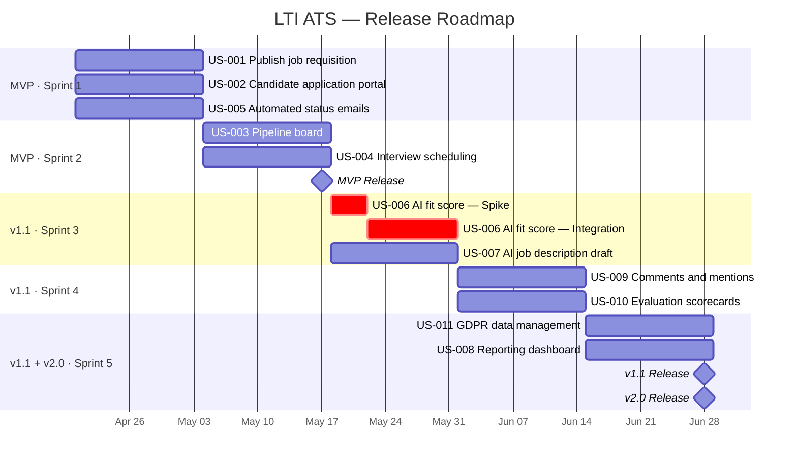

# LTI ATS — User Stories

_Generated from: LTI-JCT/PRD-JCT.md_
_Date: 2026-04-05_

---

## Epic Index

| ID    | Epic Name                          | Business Objective                                              | Linked KPI                              | FR Coverage                     |
|-------|------------------------------------|-----------------------------------------------------------------|-----------------------------------------|---------------------------------|
| EP-01 | Core Recruitment Pipeline          | Centralise job posting, applications, and candidate management  | Reduce time-to-hire to ≤ 28 days        | FR-001, FR-002, FR-003, FR-006, FR-009 |
| EP-02 | AI-Assisted Hiring                 | Accelerate decisions with AI scoring, drafting, and reporting   | AI adoption ≥ 70%; ≥ 25 candidates/week | FR-004, FR-005, FR-011          |
| EP-03 | Collaboration, Compliance & Admin  | Enable team feedback and satisfy GDPR obligations               | Feedback response ≤ 24 h; GDPR-ready   | FR-007, FR-008, FR-010          |

---

## EP-01: Core Recruitment Pipeline

**Business objective**: Give recruiters a single place to post jobs, receive applications, and manage candidates through a configurable pipeline — eliminating spreadsheets and email threads.
**Linked KPI**: Reduce time-to-hire from 40 days to ≤ 28 days; application-to-response time ≤ 48 hours.

---

### US-001: Publish a job requisition

**Story**: As an **HR Recruiter**, I want to create and publish a job requisition with title, department, and pipeline stages, so that the role is visible to candidates and the hiring workflow is ready to use.

**Priority**: Must have
**Linked FR**: FR-001
**Epic**: EP-01

**Acceptance Criteria**:

**Scenario 1:** Successful job publication
- **Given** a recruiter is logged in and fills in title, department, and at least one pipeline stage
- **When** they click "Publish"
- **Then** the job appears in the active jobs list, a unique application URL is generated, and the configured pipeline stages are attached

**Scenario 2:** Incomplete form blocked
- **Given** a recruiter attempts to publish without a department
- **When** they click "Publish"
- **Then** the form shows a validation error and the job is not created

**Scenario 3:** Close a filled position
- **Given** an active job requisition exists
- **When** the recruiter marks it as "Filled"
- **Then** the application URL becomes inactive and the requisition moves to the closed jobs archive

---

### US-002: Apply for a job as a candidate

**Story**: As a **Candidate**, I want to submit an application and upload my resume via a public web form, so that I can apply without creating an account on a third-party site.

**Priority**: Must have
**Linked FR**: FR-002
**Epic**: EP-01

**Acceptance Criteria**:

**Scenario 1:** Successful application submission
- **Given** a candidate accesses a published job URL
- **When** they complete the form and upload a valid resume (PDF or DOCX, ≤ 5 MB)
- **Then** a confirmation email is sent within 2 minutes, a candidate profile is created, and they appear in the first pipeline stage

**Scenario 2:** Duplicate application rejected
- **Given** a candidate has already applied to a role with the same email
- **When** they attempt to submit again
- **Then** the system shows an informative message and the original application is preserved unchanged

**Scenario 3:** GDPR consent captured
- **Given** a candidate submits the form
- **When** the submission is processed
- **Then** explicit consent to process personal data is recorded with a timestamp and stored as an auditable record

---

### US-003: Manage candidates on the pipeline board

**Story**: As an **HR Recruiter**, I want to view all candidates for a job in a visual pipeline board and move them between stages, so that I can manage the hiring workflow at a glance without navigating multiple screens.

**Priority**: Must have
**Linked FR**: FR-003
**Epic**: EP-01

**Acceptance Criteria**:

**Scenario 1:** Move a candidate to a new stage
- **Given** a recruiter views a candidate card on the pipeline board
- **When** they drag the card to a new stage column
- **Then** the candidate's stage updates immediately, any configured automations for that stage trigger, and an audit log entry is created with actor and timestamp

**Scenario 2:** Bulk stage move
- **Given** a recruiter selects multiple candidates
- **When** they choose "Move to stage" from the bulk actions menu
- **Then** all selected candidates move to the specified stage and automations fire for each individually

---

### US-004: Schedule an interview with automatic invites

**Story**: As an **HR Recruiter**, I want to schedule interviews from the candidate profile and have calendar invites sent automatically to all participants, so that I eliminate back-and-forth coordination emails.

**Priority**: Must have
**Linked FR**: FR-006
**Epic**: EP-01

**Acceptance Criteria**:

**Scenario 1:** Interview scheduled successfully
- **Given** a candidate is in an interview-eligible stage
- **When** the recruiter creates an interview slot and selects participants
- **Then** all participants receive a calendar invite via email, the interview appears on the candidate's timeline, and a reminder is sent 24 hours before

**Scenario 2:** Interview rescheduled
- **Given** a scheduled interview exists
- **When** the recruiter changes the time
- **Then** updated invites are sent to all participants, the original invite is cancelled, and the candidate's timeline reflects the new time

---

### US-005: Receive automated status emails as a candidate

**Story**: As a **Candidate**, I want to receive automated email updates when my application status changes, so that I am not left wondering where I stand in the process.

**Priority**: Must have
**Linked FR**: FR-009
**Epic**: EP-01

**Acceptance Criteria**:

**Scenario 1:** Acknowledgment on application
- **Given** a candidate submits an application
- **When** the submission is processed
- **Then** an acknowledgment email is sent within 2 minutes

**Scenario 2:** Stage-change notification
- **Given** a recruiter moves a candidate to a stage that has an email template configured
- **When** the stage transition occurs
- **Then** the email is sent to the candidate within 5 minutes using the configured template with the candidate's name merged

**Scenario 3:** Rejection notification
- **Given** a recruiter moves a candidate to the "Rejected" stage
- **When** the transition occurs
- **Then** a rejection email is sent automatically and the candidate can no longer access the application portal for that role

---

## EP-02: AI-Assisted Hiring

**Business objective**: Reduce manual effort in job creation and candidate review by embedding AI scoring, drafting, and insight tools into the core recruiter workflow.
**Linked KPI**: AI adoption ≥ 70% of job postings; recruiter processes ≥ 25 candidates per week.

---

### US-006: Get an AI fit score for every applicant

**Story**: As an **HR Recruiter**, I want to receive an AI-generated fit score with a brief rationale for each applicant, so that I can prioritise my review queue without reading every resume from scratch.

**Priority**: Must have
**Linked FR**: FR-004
**Epic**: EP-02

**Acceptance Criteria**:

**Scenario 1:** Score generated on application
- **Given** a candidate submits an application with a resume
- **When** the system processes the submission
- **Then** a fit score between 0 and 100 is displayed on the candidate card within 60 seconds, accompanied by a rationale of ≤ 3 bullet points, clearly labelled as AI-generated

**Scenario 2:** Recruiter overrides the score
- **Given** a recruiter disagrees with an AI score
- **When** they mark it as "Overridden" and proceed with the candidate
- **Then** the override is recorded in the audit log and the candidate's manual status takes precedence in sorted views

---

### US-007: Draft a job description with AI assistance

**Story**: As an **HR Recruiter**, I want to generate a draft job description using AI when creating a requisition, so that I can post openings faster without starting from a blank page.

**Priority**: Must have
**Linked FR**: FR-005
**Epic**: EP-02

**Acceptance Criteria**:

**Scenario 1:** Draft generated successfully
- **Given** a recruiter has entered a role title and department
- **When** they click "Generate with AI"
- **Then** a structured draft (summary, responsibilities, requirements, nice-to-haves) appears in the editor within 10 seconds and every section is editable before publishing

**Scenario 2:** Draft regenerated after editing
- **Given** a recruiter modifies the key responsibilities in a generated draft
- **When** they click "Regenerate"
- **Then** a new draft incorporating the updated responsibilities is produced and the previous version is accessible via "Undo"

---

### US-008: View pipeline health and time-to-hire metrics

**Story**: As an **HR Recruiter**, I want to view a dashboard showing active pipeline metrics and time-to-hire trends, so that I can identify bottlenecks and report progress to leadership.

**Priority**: Should have
**Linked FR**: FR-011
**Epic**: EP-02

**Acceptance Criteria**:

**Scenario 1:** Dashboard loads with live data
- **Given** a recruiter opens the dashboard
- **When** the page loads
- **Then** they see the number of open roles, total active candidates, and candidates per stage — data no more than 60 seconds stale

**Scenario 2:** Time-to-hire report by date range
- **Given** a recruiter selects a date range
- **When** the report is generated
- **Then** average time-to-hire is shown per job and in aggregate, and stage conversion rates are displayed as a funnel

---

## EP-03: Collaboration, Compliance & Administration

**Business objective**: Enable structured team feedback on candidates and ensure the platform meets GDPR obligations from day one.
**Linked KPI**: Hiring manager feedback response ≤ 24 hours; full GDPR compliance at launch.

---

### US-009: Collaborate on candidates via comments and mentions

**Story**: As a **Hiring Manager**, I want to leave comments on a candidate profile and @mention a colleague, so that collaboration happens in context and not scattered across email threads.

**Priority**: Must have
**Linked FR**: FR-007
**Epic**: EP-03

**Acceptance Criteria**:

**Scenario 1:** Comment with mention submitted
- **Given** a hiring manager is viewing a candidate profile
- **When** they submit a comment containing @username
- **Then** the comment appears immediately on the profile, the mentioned user receives an in-app notification and an email, and all team members with job access can see the comment

**Scenario 2:** Comments inaccessible to candidates
- **Given** internal users have added comments on a candidate profile
- **When** a candidate accesses their application
- **Then** internal comments are not visible to the candidate

---

### US-010: Submit and view structured evaluation scorecards

**Story**: As a **Hiring Manager**, I want to complete a structured scorecard after interviewing a candidate, so that my feedback is captured consistently and visible to the full hiring team.

**Priority**: Must have
**Linked FR**: FR-008
**Epic**: EP-03

**Acceptance Criteria**:

**Scenario 1:** Scorecard submitted successfully
- **Given** an interviewer has completed an interview
- **When** they fill in the scorecard and submit
- **Then** the scorecard is saved and linked to the candidate profile, and the recruiter receives a notification that feedback is available

**Scenario 2:** Aggregated results visible to the team
- **Given** multiple interviewers have submitted scorecards for the same candidate
- **When** a recruiter or hiring manager views the candidate profile
- **Then** individual scores with interviewer attribution are visible alongside an average score across all submitted scorecards

---

### US-011: Manage candidate data to comply with GDPR

**Story**: As an **HR Admin**, I want to export, anonymise, or delete candidate personal data on request, so that the platform honours GDPR rights to portability and erasure.

**Priority**: Must have
**Linked FR**: FR-010
**Epic**: EP-03

**Acceptance Criteria**:

**Scenario 1:** Data export triggered
- **Given** an HR Admin receives a GDPR data access request
- **When** they trigger a data export for the candidate's email
- **Then** a file containing all stored personal data is generated within 72 hours, delivered securely, and the action is logged

**Scenario 2:** Erasure request executed
- **Given** a candidate submits a deletion request
- **When** an HR Admin executes the erasure
- **Then** all personally identifiable information is deleted or anonymised, aggregate metrics derived from that data are preserved in anonymised form, and the deletion event is logged with timestamp and actor

**Scenario 3:** Retention policy alert
- **Given** a candidate's application has exceeded the configured retention period
- **When** the retention deadline approaches
- **Then** HR Admins are notified before automated anonymisation takes place

---

## Report

| Metric         | Value |
|----------------|-------|
| Epics created  | 3     |
| Stories created| 11    |

**PRD sections with no direct story coverage:**
- FR-013 (user role and permission management from US-014 in Section 6) — not mapped to a dedicated story; covered implicitly by the RBAC foundation required for all epics. Recommend adding a dedicated admin story in a backlog refinement session if sprint capacity allows.
- AI interview question suggestions (FR-005 extension / US-017) — deferred; covered by the AI epic scope but not written as a standalone story within the 2–5 per epic constraint.

**Assumptions made:**
1. The 1–3 epic constraint required broad groupings; collaboration and GDPR were merged into a single epic (EP-03) rather than split into two separate ones.
2. "Should have" priority was applied only to FR-011 (reporting dashboard), consistent with its Phase 6 placement in the PRD implementation plan.
3. AI scores being advisory-only and GDPR consent capture are treated as non-negotiable constraints embedded in story acceptance criteria, not as separate stories.

---

## Story Map

_Technique: Jeff Patton's User Story Mapping_
_Activities ordered chronologically across the backbone. Stories ordered top-to-bottom by priority within each activity. Horizontal cut lines define releases._

```
BACKBONE   Post a Job     Apply          Review           Schedule        Evaluate         Communicate      Report &
                                         Candidates       Interview       Candidates       Outcome          Comply
           ─────────────────────────────────────────────────────────────────────────────────────────────────────────
MVP        US-001         US-002         US-003           US-004          (gap — see *)    US-005
           ─────────────────────────────────────────────────────────────────────────────────────────────────────────
v1.1       US-007         .              US-006           .               US-009           .                US-011
           .              .              .                .               US-010           .                .
           ─────────────────────────────────────────────────────────────────────────────────────────────────────────
v2.0       .              .              .                .               .                .                US-008
```

### Backbone Activities

| # | Activity             | Description                                                  |
|---|----------------------|--------------------------------------------------------------|
| 1 | Post a Job           | Recruiter creates, AI-drafts, and publishes a job requisition |
| 2 | Apply                | Candidate submits application and uploads resume             |
| 3 | Review Candidates    | Recruiter views pipeline board and AI-ranked applicants      |
| 4 | Schedule Interview   | Recruiter schedules and sends calendar invites               |
| 5 | Evaluate Candidates  | Hiring Manager comments, mentions, and submits scorecard     |
| 6 | Communicate Outcome  | System sends automated status and rejection emails           |
| 7 | Report & Comply      | Admin views dashboard metrics and handles GDPR requests      |

### Release Cut Rationale

**MVP** — thin end-to-end slice: a recruiter can post a job, a candidate can apply, the recruiter can review and advance candidates, schedule an interview, and the candidate receives an automated outcome email. This is the minimum viable hiring loop.

**v1.1** — adds differentiation and compliance: AI scoring (US-006) and AI job description drafting (US-007) reduce manual work; comments and scorecards (US-009, US-010) enable structured team collaboration; GDPR tooling (US-011) satisfies legal obligations before scaling data ingestion.

**v2.0** — adds insight: reporting dashboard (US-008) enables data-driven hiring decisions and leadership reporting.

### Journey Gaps

- **\* Evaluate Candidates — MVP gap**: No evaluation story reaches the MVP cut. The end-to-end journey is technically completable without scorecards, but hiring decisions rely solely on recruiter judgement. Consider pulling US-010 (scorecards) into MVP if a structured feedback step is required before an offer is made.
- **Communicate Outcome — v1.1+ gap**: US-005 covers automated comms in MVP but there is no dedicated story for the offer-sent notification (the PRD ends at offer sent). Flag for backlog refinement.

---

## Product Backlog

_Generated from: LTI-JCT/UserStories-JCT.md + LTI-JCT/PRD-JCT.md_
_Date: 2026-04-05_

---

### EP-01 — Core Recruitment Pipeline

#### US-001: Publish a job requisition

**TK-001** · Feature · _Job requisition form_
- Build the create/edit requisition form with fields: title, department, location, employment type, and pipeline stage selector.
- **Points**: 3 · **Priority**: High · **Source**: US-001

**TK-002** · Technical Task · _Requisition data model and API_
- Define the job requisition data model. Implement create, read, update, and close endpoints. Enforce the rule that title, department, and at least one stage are required before publishing.
- **Points**: 3 · **Priority**: High · **Source**: US-001

---

#### US-002: Apply for a job as a candidate

**TK-004** · Feature · _Public candidate application form_
- Build the public web form (no login required): personal details, resume upload (PDF/DOCX ≤ 5 MB), role-specific questions. Include GDPR consent checkbox.
- **Points**: 3 · **Priority**: High · **Source**: US-002

**TK-005** · Technical Task · _Candidate profile creation and resume storage_
- On submission, create a candidate profile, store the uploaded document, and place the candidate in the first pipeline stage. Reject duplicates by email.
- **Points**: 3 · **Priority**: High · **Source**: US-002

**TK-006** · Technical Task · _GDPR consent capture_
- Record explicit consent with timestamp on every submission. Store consent records in an auditable, immutable log. Consent must be retained even after erasure of other candidate data.
- **Points**: 2 · **Priority**: High · **Source**: US-002

---

#### US-003: Manage candidates on the pipeline board

**TK-008** · Feature · _Kanban pipeline board_
- Build the per-job Kanban board with candidate cards (name, days in stage, last activity). Support drag-and-drop and bulk stage move via action menu.
- **Points**: 5 · **Priority**: High · **Source**: US-003

**TK-009** · Technical Task · _Stage transition logic and automation triggers_
- Implement stage change persistence, audit log (actor + timestamp), and the trigger dispatcher that fires configured automations on transition.
- **Points**: 3 · **Priority**: High · **Source**: US-003

---

#### US-004: Schedule an interview with automatic invites

**TK-011** · Feature · _Interview scheduling UI_
- Build the inline scheduling panel on the candidate profile: date/time picker, participant selector, optional external meeting link field.
- **Points**: 3 · **Priority**: High · **Source**: US-004

**TK-012** · Technical Task · _iCal invite generation and email dispatch_
- Generate a standard iCal (.ics) file per interview and send it to all participants via the email delivery service. Cancel and reissue on reschedule.
- **Points**: 3 · **Priority**: High · **Source**: US-004

**TK-013** · Technical Task · _24-hour interview reminder job_
- Implement a scheduled job that sends a reminder email to all interview participants 24 hours before the scheduled time.
- **Points**: 2 · **Priority**: Medium · **Source**: US-004

---

#### US-005: Receive automated status emails

**TK-015** · Feature · _Email template editor_
- Build the HR Admin template editor: create/edit templates per pipeline stage, support candidate name merge tag, enforce non-deletable acknowledgment and rejection defaults.
- **Points**: 3 · **Priority**: High · **Source**: US-005

**TK-016** · Technical Task · _Stage-triggered email dispatch_
- On stage transition, look up the configured template for the new stage and dispatch an email to the candidate within 5 minutes. Rejection email must always fire and cannot be disabled.
- **Points**: 3 · **Priority**: High · **Source**: US-005

---

### EP-02 — AI-Assisted Hiring

#### US-006: Get an AI fit score for every applicant

**TK-018** · Spike · _AI resume scoring — model and API selection_ (max 2 days)
- Evaluate available LLM APIs for resume-to-JD fit scoring. Produce a decision document covering accuracy, latency (target < 60s), cost, and GDPR data-processing implications. Outcome feeds TK-019.
- **Points**: 2 · **Priority**: High · **Source**: US-006

**TK-019** · Technical Task · _AI scoring service integration_
- Integrate the selected API (from TK-018 spike). On application submission, extract resume text, call the scoring endpoint, and persist score (0–100) + rationale (≤ 3 bullets) on the candidate profile.
- **Points**: 5 · **Priority**: High · **Source**: US-006

**TK-020** · Feature · _Fit score display on pipeline board and candidate profile_
- Show the AI score and rationale on the candidate card and profile. Label score as AI-generated. Add "Override" action that records the override in the audit log.
- **Points**: 3 · **Priority**: High · **Source**: US-006

---

#### US-007: Draft a job description with AI assistance

**TK-022** · Technical Task · _AI job description generation integration_
- Integrate the LLM API to generate a structured job description draft (summary, responsibilities, requirements, nice-to-haves) from role title and department input. Response target: < 10s.
- **Points**: 3 · **Priority**: High · **Source**: US-007

**TK-023** · Feature · _"Generate with AI" button and draft editor_
- Add the AI generation trigger to the requisition form. Display the draft in an editable rich-text editor. Support "Regenerate" (incorporates edits) and "Undo" (restores previous draft).
- **Points**: 3 · **Priority**: High · **Source**: US-007

---

#### US-008: View pipeline health and time-to-hire metrics

**TK-025** · Technical Task · _Metrics aggregation queries_
- Implement data queries for: open roles count, candidates per stage, average time-to-hire per job and aggregate, stage conversion rates. Apply role-based access filtering.
- **Points**: 3 · **Priority**: Medium · **Source**: US-008

**TK-026** · Feature · _Reporting dashboard UI_
- Build the dashboard view: pipeline health summary cards, time-to-hire trend, stage conversion funnel. Data must be no more than 60 seconds stale.
- **Points**: 5 · **Priority**: Medium · **Source**: US-008

---

### EP-03 — Collaboration, Compliance & Administration

#### US-009: Collaborate via comments and mentions

**TK-028** · Feature · _Comment thread with @mention on candidate profile_
- Build the comment thread UI on the candidate profile. Support @username autocomplete. Display comments in chronological order with author and timestamp. Show comment count on pipeline card.
- **Points**: 3 · **Priority**: High · **Source**: US-009

**TK-029** · Technical Task · _Mention notification dispatch_
- On @mention, send an in-app notification and an email to the mentioned user. Ensure comments are never visible to candidates.
- **Points**: 3 · **Priority**: High · **Source**: US-009

---

#### US-010: Submit and view evaluation scorecards

**TK-031** · Feature · _Scorecard template configurator (HR Admin)_
- Build the admin UI to create and manage scorecard templates (≤ 5 criteria per template) assignable per job type.
- **Points**: 3 · **Priority**: High · **Source**: US-010

**TK-032** · Feature · _Scorecard submission form and aggregated results view_
- Build the interviewer scorecard submission form (locked after submit). Display individual scores with attribution and average score on the candidate profile.
- **Points**: 5 · **Priority**: High · **Source**: US-010

**TK-033** · Technical Task · _Scorecard data model and submission lock_
- Implement scorecard persistence, locking after submission, HR Admin override capability, and recruiter notification on submission.
- **Points**: 3 · **Priority**: High · **Source**: US-010

---

#### US-011: Manage candidate data for GDPR

**TK-035** · Feature · _GDPR admin tools: export, erasure, retention alerts_
- Build the HR Admin GDPR panel: trigger data export (JSON/CSV, delivered within 72h), execute erasure (anonymise PII, preserve aggregate data), view retention expiry alerts.
- **Points**: 5 · **Priority**: High · **Source**: US-011

**TK-036** · Technical Task · _Data anonymisation job and retention enforcement_
- Implement the scheduled retention check: notify HR Admins before expiry, anonymise PII on the expiry date if not extended. Log all actions with timestamp and actor.
- **Points**: 3 · **Priority**: High · **Source**: US-011

---

### Summary Table

| Ticket | Type | Story | Title | Points | Priority |
|--------|------|-------|-------|--------|----------|
| TK-001 | Feature | US-001 | Job requisition form | 3 | High |
| TK-002 | Technical Task | US-001 | Requisition data model and API | 3 | High |
| TK-004 | Feature | US-002 | Public candidate application form | 3 | High |
| TK-005 | Technical Task | US-002 | Candidate profile creation and resume storage | 3 | High |
| TK-006 | Technical Task | US-002 | GDPR consent capture | 2 | High |
| TK-008 | Feature | US-003 | Kanban pipeline board | 5 | High |
| TK-009 | Technical Task | US-003 | Stage transition logic and automation triggers | 3 | High |
| TK-011 | Feature | US-004 | Interview scheduling UI | 3 | High |
| TK-012 | Technical Task | US-004 | iCal invite generation and email dispatch | 3 | High |
| TK-013 | Technical Task | US-004 | 24-hour interview reminder job | 2 | Medium |
| TK-015 | Feature | US-005 | Email template editor | 3 | High |
| TK-016 | Technical Task | US-005 | Stage-triggered email dispatch | 3 | High |
| TK-018 | Spike | US-006 | AI resume scoring — model and API selection | 2 | High |
| TK-019 | Technical Task | US-006 | AI scoring service integration | 5 | High |
| TK-020 | Feature | US-006 | Fit score display on pipeline board and candidate profile | 3 | High |
| TK-022 | Technical Task | US-007 | AI job description generation integration | 3 | High |
| TK-023 | Feature | US-007 | "Generate with AI" button and draft editor | 3 | High |
| TK-025 | Technical Task | US-008 | Metrics aggregation queries | 3 | Medium |
| TK-026 | Feature | US-008 | Reporting dashboard UI | 5 | Medium |
| TK-028 | Feature | US-009 | Comment thread with @mention on candidate profile | 3 | High |
| TK-029 | Technical Task | US-009 | Mention notification dispatch | 3 | High |
| TK-031 | Feature | US-010 | Scorecard template configurator (HR Admin) | 3 | High |
| TK-032 | Feature | US-010 | Scorecard submission form and aggregated results view | 5 | High |
| TK-033 | Technical Task | US-010 | Scorecard data model and submission lock | 3 | High |
| TK-035 | Feature | US-011 | GDPR admin tools: export, erasure, retention alerts | 5 | High |
| TK-036 | Technical Task | US-011 | Data anonymisation job and retention enforcement | 3 | High |

**Total tickets**: 26 · **Total points**: 85
**Breakdown**: 11 Feature · 14 Technical Task · 1 Spike

---

## Roadmap

_Sprint duration: 2 weeks · Velocity: 20 pts/sprint · Start date: 2026-04-20_
_Total: 85 pts across 5 sprints (10 weeks)_

---

### Sprint 1 — MVP · 2026-04-20 → 2026-05-03

| Story | Title | Priority | Points |
|-------|-------|----------|--------|
| US-001 | Publish a job requisition | Must have | 6 |
| US-002 | Apply for a job as a candidate | Must have | 8 |
| US-005 | Receive automated status emails | Must have | 6 |
| **Total** | | | **20 / 20 pts** |

---

### Sprint 2 — MVP · 2026-05-04 → 2026-05-17

| Story | Title | Priority | Points |
|-------|-------|----------|--------|
| US-003 | Manage candidates on the pipeline board | Must have | 8 |
| US-004 | Schedule an interview with automatic invites | Must have | 8 |
| **Total** | | | **16 / 20 pts** · 4 pts buffer |

> 🚀 **MVP Released: 2026-05-17**
> End-to-end hiring loop live: post job → apply → review pipeline → schedule interview → automated outcome email.

---

### Sprint 3 — v1.1 · 2026-05-18 → 2026-05-31

| Story | Title | Priority | Points |
|-------|-------|----------|--------|
| US-006 | Get an AI fit score for every applicant | Must have | 10 |
| US-007 | Draft a job description with AI assistance | Must have | 6 |
| **Total** | | | **16 / 20 pts** · 4 pts buffer |

> ⚠️ **Dependency**: TK-018 (Spike — AI model selection, 2 pts) must complete in week 1 of this sprint before TK-019 (AI scoring integration, 5 pts) can start in week 2.

---

### Sprint 4 — v1.1 · 2026-06-01 → 2026-06-14

| Story | Title | Priority | Points |
|-------|-------|----------|--------|
| US-009 | Collaborate via comments and mentions | Must have | 6 |
| US-010 | Submit and view evaluation scorecards | Must have | 11 |
| **Total** | | | **17 / 20 pts** · 3 pts buffer |

---

### Sprint 5 — v1.1 + v2.0 · 2026-06-15 → 2026-06-28

| Story | Title | Priority | Points |
|-------|-------|----------|--------|
| US-011 | Manage candidate data for GDPR | Must have | 8 |
| US-008 | View pipeline health and time-to-hire metrics | Should have | 8 |
| **Total** | | | **16 / 20 pts** · 4 pts buffer |

> 🚀 **v1.1 Released: 2026-06-28**
> AI scoring, AI job drafting, team collaboration, and GDPR compliance live.

> 🚀 **v2.0 Released: 2026-06-28**
> Reporting dashboard live.

---

### Release Summary

| Release | Sprints | Date range | Stories | Points |
|---------|---------|------------|---------|--------|
| MVP | 1–2 | 2026-04-20 → 2026-05-17 | US-001, US-002, US-003, US-004, US-005 | 36 |
| v1.1 | 3–5 | 2026-05-18 → 2026-06-28 | US-006, US-007, US-009, US-010, US-011 | 41 |
| v2.0 | 5 | 2026-06-15 → 2026-06-28 | US-008 | 8 |
| **Total** | **5** | **10 weeks** | **11 stories** | **85** |

---

### Risks & Flags

- **TK-018 Spike gates Sprint 3**: if the AI model selection takes longer than week 1 of Sprint 3, TK-019 (5 pts) slips to Sprint 4, pushing US-006 across two sprints. Mitigation: timebox the spike strictly to 2 days.
- **US-010 at 11 pts** is the largest story in the backlog and consumes 55% of Sprint 4 capacity. If scope grows during refinement, split the scorecard template configurator (TK-031) from the submission form (TK-032) into separate stories before sprint commit.
- **Buffer capacity**: 15 pts of buffer across 5 sprints (Sprints 2, 3, 4, 5 have 4/4/3/4 pts free). Recommended use: defect fixes, refinement spikes, or pulling in out-of-scope stories if capacity allows.

---

## Mermaid Roadmap


